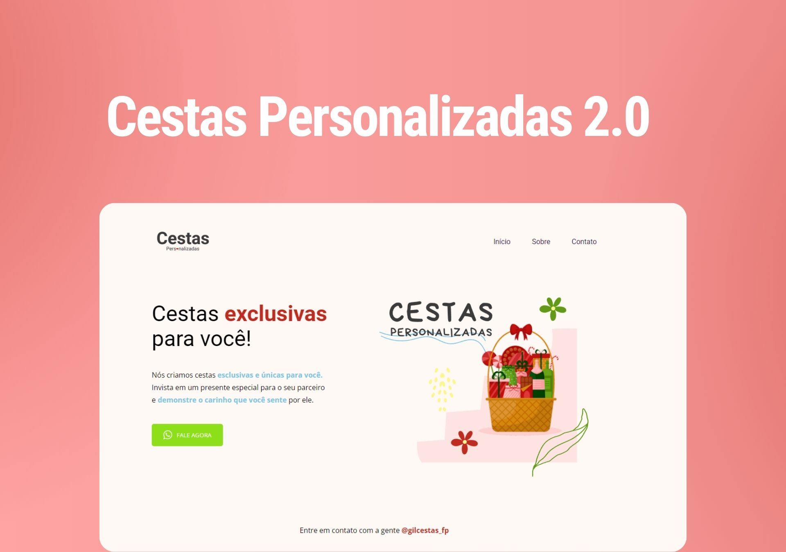

<h1 align="center"> Cestas Personalizadas 2.0 - Projeto 02 - Explorer </h1>

Página criada exclusivamente para treinamento do projeto Explorer da Rocketseat.  
<a href="https://lp.rocketseat.com.br/devlinks/inscricao?utm_source=github&utm_medium=descricao&utm_campaign=capture-devlinks&utm_term=organic&utm_content=descricao-github-mayk-brito">Estude esse projeto em formato de vídeo clicando aqui.</a>

  <a href="#-tecnologias">Tecnologias</a>&nbsp;&nbsp;&nbsp;|&nbsp;&nbsp;&nbsp;
  <a href="#-projeto">Projeto</a>&nbsp;&nbsp;&nbsp;|&nbsp;&nbsp;&nbsp;
  <a href="#-layout">Layout</a>&nbsp;&nbsp;&nbsp;|&nbsp;&nbsp;&nbsp;
  <a href="#memo-licença">Licença</a>

  

 

  

## 🚀 Tecnologias

Esse projeto foi desenvolvido com as seguintes tecnologias:

- HTML e CSS
- Git e Github
- Figma

## 💻 Projeto

Essa é apenas um exemplo do uso das ferramentas HTML e CSS.

- [Acesse o projeto finalizado, online](https://github.com/viniciustheara/projeto-02-explorer)

## :memo: Licença

Esse projeto está sob a licença MIT.

---

Feito com ♥ por Vinícius Araújo :wave:
